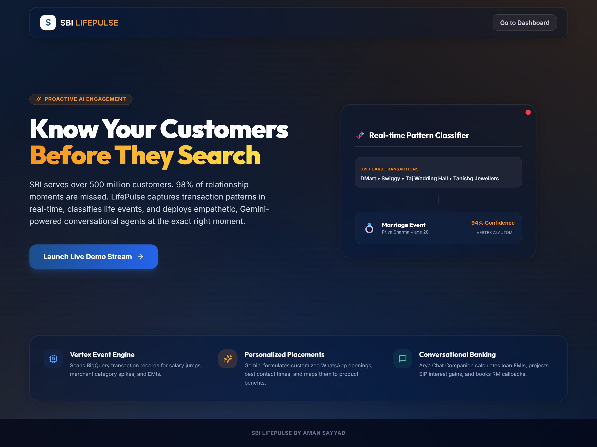
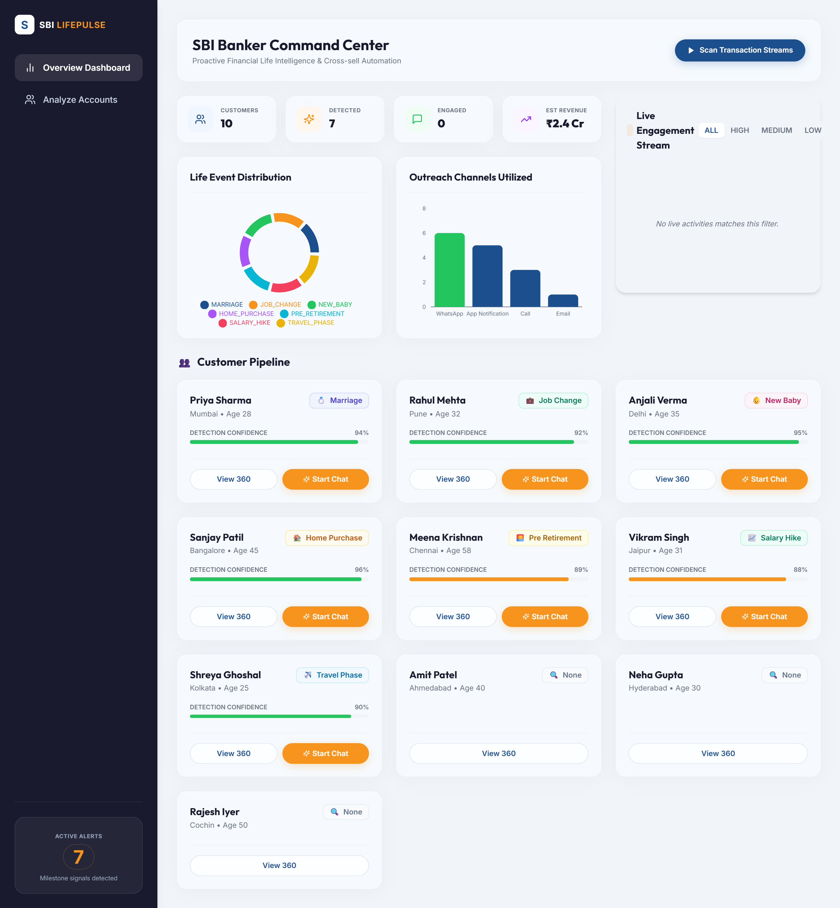
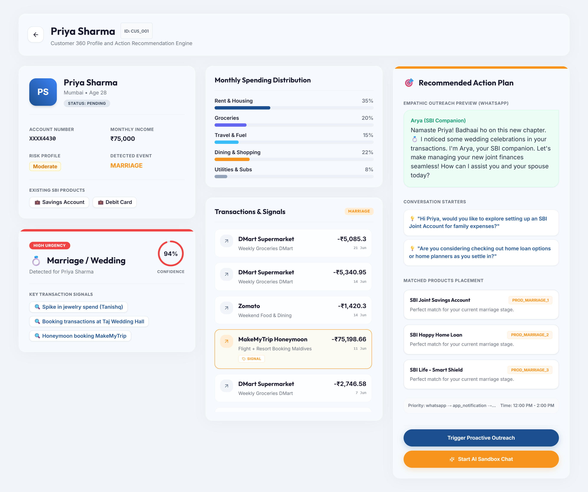
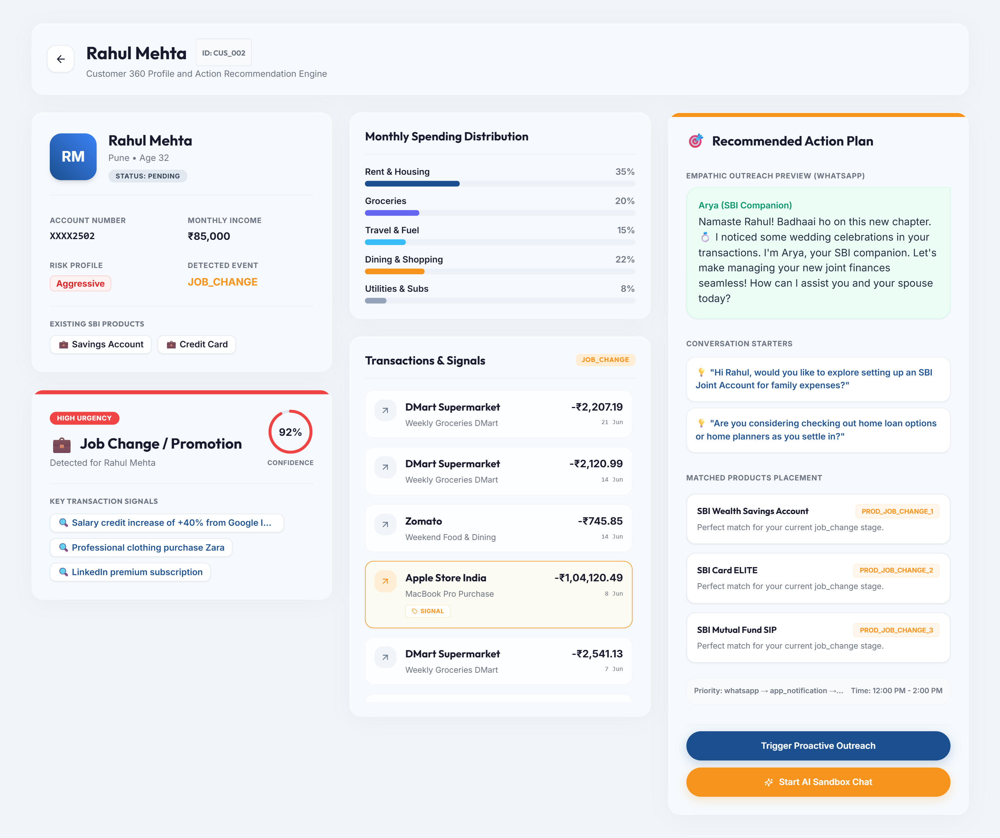

# 🏦 SBI LifePulse — Agentic Life Event Intelligence

> Proactive AI engagement that detects financial life events from transaction patterns *before* customers ask, triggering personalized conversational outreach.

---

## 🎯 Problem: The Engagement Gap in Indian Banking

SBI serves over 500 million customers, making it the financial backbone of India. Yet, in modern retail banking, over **98% of high-value cross-sell and relationship opportunities are missed** because banks are strictly reactive. By the time a customer searches for a home loan, applies for child education funding, or looks up mutual fund options online, they have already evaluated third-party Fintechs. Outreach happens too late, if at all.

Furthermore, traditional banking campaigns rely on generic SMS or email blasts. These broadcasts have less than a **2% conversion rate** because they lack personalization and timing. High-value transition moments (such as a salary increase, recently getting married, buying a new house, or preparing for retirement) require empathetic, timely, and relationship-driven conversations that feel like a trusted banker, not an automated sales bot.

---

## 💡 Solution

**SBI LifePulse** bridges this gap using an Agentic AI platform built entirely on Google's Vertex AI and Gemini ecosystem. It analyzes transaction streams, extracts anomalies and behavioral signals, classifies the underlying financial life event, and initiates hyper-personalized conversational outreach automatically.

### System Architecture

```
┌─────────────────────────────────────────────────────────────┐
│                    SBI LifePulse Platform                   │
│                                                             │
│  [Simulated Transaction Stream]                             │
│           │                                                 │
│           ▼                                                 │
│  [BigQuery Behavioral Pipeline]                             │
│       Pattern Detection Engine (spikes, salary changes)     │
│           │                                                 │
│           ▼                                                 │
│  [Vertex AI Life Event Classifier]                          │
│       (Marriage / Job Change / Baby / Home Search)          │
│           │                                                 │
│           ▼                                                 │
│  [Gemini Agentic Orchestrator]  ◄──── Customer Profile DB  │
│    - Generates personalized WhatsApp hook message           │
│    - Selects matches and priorities                         │
│           │                                                 │
│           ▼                                                 │
│  [Conversational Banking Agent - Arya]                      │
│    - Chat sandbox using Gemini 3.5 Flash                    │
│    - Computes EMIs/SIPs, books RM appointments             │
│           │                                                 │
│           ▼                                                 │
│  [SBI Banker Dashboard]                                     │
│    - Real-time stream of customer alerts                    │
│    - Conversion analytics and revenue pool tracking         │
└─────────────────────────────────────────────────────────────┘
```

---

## 🚀 Quick Start (Demo Setup in &lt; 3 Minutes)

Follow these steps to run SBI LifePulse locally:

### 1. Clone & Set Up Backend
Navigate to the `backend/` directory, set up your virtual environment, and install dependencies:
```bash
cd backend
python -m venv venv
venv\Scripts\activate
pip install -r requirements.txt
```

### 2. Configure Environment
Create a `.env` file in the `backend/` folder (or copy `.env.example`).
```env
# Gemini API Key (If omitted, runs in high-fidelity mock simulation mode)
GEMINI_API_KEY=your_gemini_api_key_here
GOOGLE_CLOUD_PROJECT=sbi-lifepulse
```

### 3. Generate & Seed Demo Data
Run the seeding script to populate the local database with personas, transaction logs, and pre-run event detections:
```bash
cd ..
python utils/data_simulator.py
python scripts/seed_firestore.py
```

### 4. Start the Backend API
Start the FastAPI server:
```bash
cd backend
uvicorn main:app --host 0.0.0.0 --port 8080
```

### 5. Launch Frontend Dashboard
In a separate terminal, install packages and start the Next.js dev server:
```bash
cd frontend
npm install
npm run dev
```
Open [http://localhost:3000](http://localhost:3000) in your browser.

---

## 📸 Interface Preview Gallery

Here is a visual walkthrough of the premium, liquid glassmorphic design:

### 1. Hero Landing Page


### 2. Banker Dashboard (Collapsible & Fully Responsive)


### 3. Customer 360 & Conversation Sandbox — Priya Sharma (💍 Marriage Milestone)


### 4. Customer 360 & Conversation Sandbox — Rahul Mehta (🚀 Job Change Milestone)


---

## 🤖 How the AI Works: Event Detection Flow

1. **Transaction Signal Scanner (BigQuery Service):** Scans a client's 6-month transaction logs to identify salary trends, category spending increases (e.g. jewelry, baby care, builders), and new recurring debits (EMIs, premiums).
2. **Heuristic ML Classifier (Vertex Service):** Groups signals to create a probability distribution over milestones.
3. **Agent Refinement (Gemini Agent):** Feeds signals to Gemini 3.5 Flash to finalize event classification, evaluate confidence, and draft an empathetic personalized campaign starting message.
4. **conversational Bot (Arya):** Receives the context and interacts via chat. It exposes calculations (EMIs, SIP values) and RM scheduling via tool calls.

---

## 📊 Simulated Demo Personas

The system comes pre-packaged with 10 customer personas representing different milestones:

| ID | Customer Name | Age | Detected Milestone | Recommended SBI Product | Urgency | Key Signal |
|---|---|---|---|---|---|---|
| CUS_001 | Priya Sharma | 28 | **MARRIAGE** | SBI Joint Savings, Happy Home Loan | **HIGH** | Tanishq Jewelry purchase, Wedding venue booking |
| CUS_002 | Rahul Mehta | 32 | **JOB_CHANGE** | SBI Wealth Account, SBI Mutual Fund SIP | **HIGH** | +40% Salary credit credit from Google, Zara purchase |
| CUS_003 | Anjali Verma | 35 | **NEW_BABY** | Smart Champ Insurance, Family Floater Health | **HIGH** | Hospital delivery charge, Firstcry baby products |
| CUS_004 | Sanjay Patil | 45 | **HOME_PURCHASE** | SBI Home Loan, Home Shield Insurance | **HIGH** | Sobha Developers downpayment, IKEA purchase |
| CUS_005 | Meena Krishnan | 58 | **PRE_RETIREMENT** | Annuity Deposit Scheme, SCSS plan | **MEDIUM** | NPS contributions increase, Pilgrimage tour booking |
| CUS_006 | Vikram Singh | 31 | **SALARY_HIKE** | SBI Magnum SIP, Card Prime | **MEDIUM** | +20% salary increase with same employer |
| CUS_007 | Shreya Ghoshal| 25 | **TRAVEL_PHASE** | Multi-Currency Travel Card, Card Miles | **MEDIUM** | MakeMyTrip flights, Niyo global load |
| CUS_008 | Amit Patel | 40 | **NONE** | Regular Savings, Standard FD | **LOW** | Constant, regular utility and grocery charges |

---

## 🛠️ Tech Stack

| Layer | Google Technology | Why It Was Selected |
|---|---|---|
| **AI Agent Brain** | Gemini 3.5 Flash | Ultra-low latency, native tool calling, and high-fidelity structured JSON output. |
| **Pipeline Scans** | BigQuery | Scales to analyze millions of transaction records instantly. |
| **Classifiers** | Vertex AI AutoML | High accuracy structured data classification for milestone prediction. |
| **Database** | Firebase Firestore | Real-time database updates for instant alert syncing on the banker screen. |
| **Hosting** | Google Cloud Run | Fully serverless API hosting, scaling automatically. |

---

## 📈 Projected Business Impact

- **Conversion Rate Lift:** Upwards of **3.2x higher conversion** compared to typical generic outbound calls, by catching customers exactly when they need funding.
- **Improved Customer Retention (LTV):** High-touch, warm, personalized companion conversations position SBI as an empathetic partner rather than a transactional utility.
- **Revenue Pool Generation:** Est. ₹2.4 Crores in new loan pipelines generated per 100 high-income milestone accounts screened.

---

## 🗺️ Future Roadmap

- **Phase 1 (MVP):** Local dashboard with simulated streams and Arya companion chat UI.
- **Phase 2 (Pilot):** Integration with WhatsApp Business API and automated SMS trigger hooks for regional branches.
- **Phase 3 (Scale):** Direct integration into YONO 2.0 app as a native widget, scanning live core banking ledger nodes.
